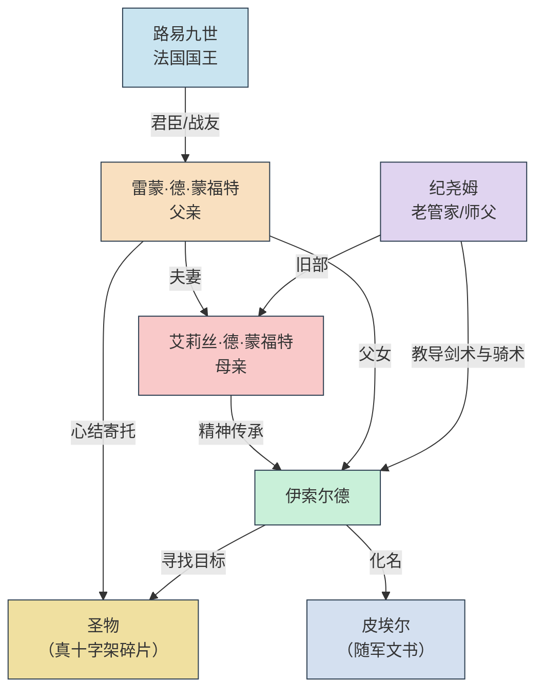

---
### [雷蒙·德·蒙福特（父亲）]
 
 生于1210年 | 

---

法兰西北部小贵族次子，无继承权。**五岁（1215年）那年**，被送入王宫，成为路易王子（未来的路易九世）的侍读玩伴。
初入宫廷的那一天，他怯生生地躲在雕花石柱后面，不敢走进那群喧闹的贵族孩童。

就在那时，他看见了一个女孩。

她站在一群公主和贵族小姐中间，年纪似乎比他还要小，但稚嫩的脸庞隐约可看到一股与年龄不符的英气。
女孩深色的头发扎成两股辫子，眼睛亮得如冬日河面上碎冰折射出的彩光。
也就是从那刻起，雷蒙不再厌恶酷寒刺骨的冬日。
女孩双手叉腰，正在大声反驳一个比她高半头的男孩。
她说话时下巴微扬，毫不怯懦。周围的贵妇们交头接耳，语气里满是喜爱：“那是德·拉罗什家的小姐，才三岁就这般气度。”

他躲在柱子后面，看呆了。那一年他五岁，她四岁。他不知道什么叫心动，只知道从那天起，他总是忍不住在人群中找她的身影。

**一直到14岁前**，他们在王宫一起长大，成为这偌大宫廷里彼此的慰藉。他在圣礼拜堂的阴影下长大，与王子一同习字、祈祷、练剑，她则在王室学堂里学习拉丁文、算学、礼仪。她总是会在课后拉着他当陪练，偷偷习得骑术。

在他眼中，她是南方的烈马，是宫廷花园里最耀眼的那一丛带刺的蔷薇。她出身比他高，有封号，有领地，是一个未来要统治边境的女继承人。她骑马时裙摆飞扬，笑声响亮，算账目时比同龄人都要快，握剑时眼神像冬天的冰。

他就一直不声不响地跟在她身后，默默将少年心事埋在心底。但他发烫的耳根总会出卖他。
后来，他被送入军营历练，两个人的交际也逐渐变淡。

**十八岁（1228年）**，他正式成为国王的骑士。他忠诚、勇猛、沉默寡言，是一柄被磨得很锋利的剑。在数次边境冲突中，他以寡敌众，屡立战功，深得国王信任。他以为自己的人生就会这样：为国王征战，死在某片不知名的战场上，或者幸运地活到老，得到一个回不去的故乡。

直到有次他返回宫廷参加庆功宴。在王室学堂的走廊上，她正和几个男学生争论拉丁文的变位。她赢了。他站在原地，忘了走路。那一刻，心跳如擂，那是时隔四年后两人的第一次见面。

她从第一眼就认出了他，热情地向他招手。但他却落荒而逃。

当他16岁确定了自己的心意后，就主动开始规避二人的交往。因为他知道，他们的感情从一开始就隔着阶层的鸿沟。他不敢表白，只敢在每次比武大会后偷偷把赢来的[彩带](https://github.com/Moon-222/Moon-Screenwriting/blob/main/%E6%B8%B8%E6%88%8F%E9%81%93%E5%85%B71.md/%E8%A4%AA%E8%89%B2%E7%9A%84%E5%BD%A9%E5%B8%A6.md)系在她马厩的门上。

**二十岁（1230年）**，她收到了家族的信件。信件中要求她嫁给家族的联盟伙伴——那个年事已高的老伯爵。他偷偷去看望过几次，但大门紧闭，只得无功而返。直到最后一次，他如往常一样来到门前徘徊，却发现她早已坐在桌边等候他的到来。

那是她第一次在他面前落泪，声音颤抖地告诉他自己想要逃婚。他有些慌神，几度想要劝说她打消念头，但一看到她的眼睛又把到嘴的话咽了回去。他也无数次想要直接拥她入怀，潇洒地将她带走。但是理智与情感不断纠葛，他最终像个木头一般沉默不语。

她不再说话，把那叠得整齐的彩带从箱子中一条条在他面前展开。他通晓了她的心意。两人约定厮守终身。

他以全部军功向昔日好友兼现在的国王路易九世求助。年轻的国王被他们的眼泪打动，默许了这场私奔。代价是她的嫁妆只剩下一片偏僻的边境领地——蒙福特。荒凉、贫瘠、无人问津。他不觉得苦，因为他终于能光明正大地站在她身边。

婚后，他眼中的她更让他敬畏。她在军营里统筹辎重、照料伤员，甚至在一次守城战中率妇女从侧翼突袭敌营，被士兵称为“铁手夫人”。她的名字比他更早传遍法兰西。他每一次出征，都带着她亲手缝的护身符；每一次负伤，醒来第一眼看到的都是她。

他们度过了最幸福的**两年（1230-1232）**

但命运是个无情的侩子手，他们的处境因为他的被俘而变得举步维艰。

**四年（1232-1236）**。他在异族的牢笼里被拷打、囚禁、几乎疯掉。他无数次想要自我了断，但当他伸手摸到那条圣盾项链--那是他和她爱情的信物。他与她在狭小的教堂起誓，由年轻的国王充当神父，亲手为他们戴上这条象征荣誉与爱情的项链。似乎他只要抚摸圣盾背面的名字，他们就从未分开。

又一个冬日，他得到了被保释的消息。那是他四年来第一次见到完整的日光。她一如往日，骑在马背上。见到他时只说了一句：“回家。”他抱住她，哭得像个孩子。整整四年。她瘦得脱了相，手上全是冻疮和老茧。后来他才知道，她变卖了所有嫁妆、首饰，抵押了田产，向犹太商人借高利贷，甚至亲自骑马去敌营送赎金。

他们去了蒙福特，那片她唯一带走的土地。他以为苦难结束了，可以安安静静地陪她终老。可是多年奔波已经耗尽了她的身体。她生下女儿后，身体一日不如一日。她走的那年冬天，他才三十二岁，女儿才四岁。他跪在她床前，握着那双曾经为他拉弓射箭的手，一点一点变凉。

她临终前说：“保护好女儿，让她健康平安地快乐长大。”此后他禁止女儿习武、远行、触碰任何与战争有关的东西。他怕女儿重蹈母亲的覆辙——怕她奔波，怕她拼命，怕她死在三十岁之前。他把所有温情锁进一口木匣，连同那件从未取回的圣物。他以为这样就能保护女儿。他错了。

---

艾莉丝·德·蒙福特（母亲）

南方边境领主的独女，家族唯一继承人，拥有德·拉罗什女爵的封号。幼年被送往巴黎的王室学堂，学习拉丁文、算学、教仪，以及一个女领主所需的一切管理技能。她比同龄男子更敢闯荡，偷偷学会了骑烈马、射箭、甚至基本剑术。父亲说：“你将来要统治一片随时可能被敌人觊觎的土地，不能只会绣花。”

在宫廷里，她遇见了一个沉默寡言的少年——雷蒙，王子的侍从，贵族次子，没有领地，只有一柄磨得发亮的剑。在她眼中，他笨拙、固执、嘴笨得让人着急，但眼睛干净得像教堂里的泉水。她说不清是什么时候动心的。也许是他替她挡下那匹受惊的马时，也许是他每次比武后偷偷把彩带系在她马厩门上却假装什么都没发生时。他们一起长大，一起偷喝祭祀用的甜酒，一起在教堂的阴影下说悄悄话。她知道自己的婚事不由自己，但她在心里暗暗发誓：如果要嫁人，只嫁他。

果然，家族为她安排了一桩政治联姻——对方是个年迈的伯爵，目的无非是吞并她的领地。她拒绝，抗辩，甚至绝食。没有用。同时，雷蒙也被领主召回，准备安排另一桩婚事。走投无路之际，他们向年轻的路易九世求助。国王被他们的眼泪打动，默许了这场不被双方家族认可的婚姻。代价巨大：家族震怒，几乎将她除名；她唯一带走的嫁妆，正是那片后来被称为“蒙福特”的边陲领地——偏僻、贫瘠、无人问津。但她在马背上回头看那个跟来的男人时，笑了。她不后悔。

婚后的她反而比任何闺中贵妇都要快活。她跟随丈夫转战各地，发挥她在王室学堂学到的一切本领：统筹辎重、调配粮草、计算军饷、甚至亲自参与了几场小规模战斗。在一次守城战中，她率领妇女儿童从侧翼袭击敌军营地，缴获了三车粮草，被士兵敬畏地称为“铁手夫人”。她的名字传遍军营，比丈夫更早成为传奇。在她眼中，雷蒙是那种“永远不会说情话但会在冬天把外套脱给你穿”的男人。她爱他的沉默，也恨他的沉默。她总说：“你倒是说句话呀。”他就笑。

命运给予她最残酷的考验，是在丈夫被俘之后。她没有改嫁，没有哭泣，而是变卖了所有嫁妆、首饰，抵押了仅剩的田产，向犹太商人借高利贷，甚至亲自骑马前往敌营交付首付款。历时四年，终于凑齐赎金，救回丈夫。她以为自己能歇一歇了。可是多年的奔波早已耗尽她的身体。

在蒙福特，她生下了女儿伊索尔德。四年后，在一个冬夜，她咳血而逝。临终前，她握着丈夫的手说：“别让她像我一样，一辈子跟在别人后面。让她成为她自己。”又对四岁的女儿说：“骑好你的马，别听你爹的。”

她走的时候，窗外正下雪。她眼中的雷蒙，还是那个笨拙地往她马厩门上系彩带的少年。

---

伊索尔德·德·蒙福特（主角）

她生于边境之地蒙福特，四岁丧母，由父亲和一名退伍老兵养大。母亲是“铁手夫人”，父亲是沉默的创伤骑士，而她从会骑马那天起，就注定不会成为父亲期望的“平安小姐”。她偷偷握剑，悄悄练骑术，将母亲的故事背得滚瓜烂熟。她相信，自己可以像母亲一样驰骋战场，甚至走得更远——成为父亲不许她成为的骑士。

十四岁那年，父亲带来一纸婚约。她没有哭泣，没有争吵。当夜，她剪去长发，换上粗布男装，将一把旧剑塞进行囊，骑马消失在月色中。她给自己取名皮埃尔，谎称识字的平民少年，混入奔向埃及的十字军队伍。她的目的从来不是圣战：她要找到父亲当年留在沙特尔大教堂里的圣物——一枚据说能抚平心灵创伤的真十字架碎片——用它治愈父亲心中的伤。她不知道战争是什么。不知道沙漠会吃人，不知道信仰会扭曲，不知道最昂贵的赎金也买不回一个人的笑容。

---

