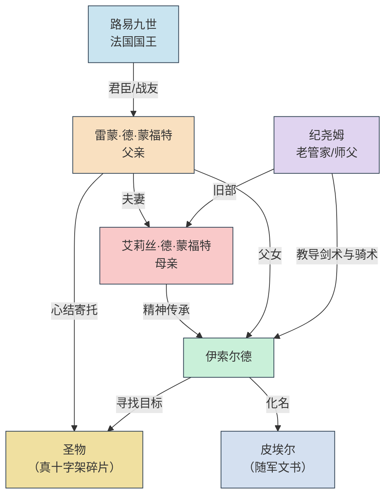

---
### [三个少年]
一、相识

那是很久以前的事了。

路易九世尚未戴上那顶沉重的王冠，还是一个十六岁的少年君主。他虔诚、热忱，相信骑士精神，也相信爱情。在他身边，有两位年龄相仿的伴读——雷蒙·德·蒙福特与艾莉丝·德·拉罗什。他们从三四岁起就被送入王宫，与国王一同习字、祈祷、练剑。三人一起长大，君臣之外，更是挚友。

雷蒙沉默寡言，艾莉丝英气飒爽。他们是宫廷里最般配的一对，却隔着阶层的鸿沟——雷蒙是贵族次子，无继承权；艾莉丝是南方边境领主的独女，拥有自己的封号。

但他们相爱了。

二、私奔

那一年，雷蒙二十岁，艾莉丝十八岁。

艾莉丝的家族为她安排了一桩政治联姻——一个年迈的伯爵。她拒绝，抗辩，甚至绝食。雷蒙也被家族召回，准备接受另一桩婚事。

走投无路之际，两个年轻人跪在十六岁的国王面前，泪流满面。

路易九世看着他们——一个是他最忠诚的侍从，一个是他最欣赏的女伴读。他沉默了很久，最终被他们的眼泪打动。那是一个君主尚相信“国王的恩典”可以成全一切的年纪。

他亲手为他们主持了婚礼，以法兰西王室的权威，默许了这场不被双方家族认可的私奔。

作为嫁妆，艾莉丝带走了那片荒凉的边境领地——拉罗什。国王将这块土地正式赐封给雷蒙，算是成全。

“你们要替我守住那片边境。”年轻的国王说，“那是法兰西的门户。”

三、被俘

婚后的生活远比想象中艰难。雷蒙继续为国王征战，艾莉丝随军同行。她以过人的骑术与谋略在数次冲突中崭露头角，被士兵称为“铁手夫人”。他们并肩作战，彼此支撑，以为苦难终会过去。

但命运没有放过他们。

1232年，在一次掩护国王撤退的战斗中，雷蒙被敌军俘虏。索要的赎金是天文数字。艾莉丝变卖了所有嫁妆、首饰，抵押了仅剩的田产，向犹太商人借高利贷，甚至亲自骑马前往敌营交付首付款。

整整两年。她在风雪与烈日之间奔走，从一个领主求到另一个领主。

1234年，她终于凑齐赎金，将丈夫从异族的囚牢中赎回。

国王感其忠诚，准许他们退回至领地拉罗什休养。但雷蒙的身心已在两年的囚禁中被严重摧残。他变得沉默、易惊、恐惧失去。艾莉丝的身体也在多年的奔波中垮了。

四、丧妻

1235年，女儿伊索尔德出生。她给这个伤痕累累的家庭带来了短暂的欢笑。

但仅仅三年后，1238年的一个冬夜，艾莉丝旧疾复发，咳血而逝，年仅二十六岁。

雷蒙跪在妻子的床前，握着那双曾经为他拉弓射箭的手，一点一点变凉。她临终前说：

“让她平安健康地长大，快乐地生活。”

他记住了前半句，却忘了后半句。

从此，他将女儿视为唯一的珍宝，但这份爱也让她成了笼中鸟。他禁止伊索尔德习武、远行、触碰任何与战争有关的东西。他害怕女儿受到伤害，害怕失去最后的亲人。

五、决裂

而在巴黎，国王路易九世也在改变。

他尚未经历十字军的惨败与被俘的屈辱——那一切要等到1248年之后。但作为一位虔诚的君主，他早已在苦行与律己的道路上越走越远。那个曾经相信“国王的恩典”可以战胜一切的少年，正逐渐变成一个以教条高于人性、秩序高于慈悲的苦修者。他开始回头审视自己年轻时的所作所为，并越来越认为：当年那场私奔式的婚礼，是他一生中少有的“离经叛道”——违背了家族的意志，也违背了教会的规则。

他给远在拉罗什的雷蒙写了一封信：“把你的女儿送到宫里来。我来照看她，给她最好的教育。”

雷蒙拒绝了。

他不想让女儿离开自己，更不想让她踏入那个曾吞噬了他和妻子的权力中心。

国王又写了一封信，措辞更加严厉。雷蒙依然拒绝。

两人在信件来往之间爆发了剧烈的争吵。国王认为，雷蒙的固执是对自己恩典的辜负；雷蒙则认为，国王已经不再是昔日那个与他们嬉笑玩闹的挚友。

最终，国王下令摧毁了雷蒙当年留在沙特尔大教堂的那件圣物——那枚见证了雷蒙与艾莉丝爱情的圣盾，也是雷蒙心心念念的、唯一能让他感到妻子还在身边的寄托。

雷蒙得知后，彻底一蹶不振。他把自己关在书房里，再不与外界通信。他更加严厉地管控女儿，甚至开始为她物色一门“安全”的婚事——嫁给一个本地的、平庸的、绝不会上战场的贵族。

他不解释原因。他只是沉默。

六、出逃

伊索尔德不知道这些往事。她只知道，父亲曾经是一位名声响彻的骑士，母亲是威名赫赫的“铁手夫人”。

她从老管家那里偷偷学会了剑术与骑术。她将自己磨炼成一个比同龄男孩更出色的骑手。

1250年，她十五岁。

父亲带来了一个陌生的青年，宣布了婚约。

她第一次对父亲进行了正面的抗争。当夜，她剪去长发，换上粗布男装，将一把旧剑塞进行囊，骑马消失在月色。

满腔热血的少女怀揣着骑士的圣约精神朝着圣都进发了。

她不明白父亲为什么要在功成名就之际退隐到拉罗什这个边陲之地，不明白父亲为什么极力阻止自己踏入领地之外，不明白父亲为什么总是暗自神伤、却又对往事闭口不提。

她从老管家的口中得知父亲圣地有一件圣物，那承载了他过去的心结。

她要去圣地，找到那件圣物，带回给父亲。她要向父亲证明，她可以。

七、尾声

伊索尔德在军中见到了被赎回的路易九世。她反复追问圣物的下落，国王却总是回避。她私下调查，逐渐拼凑出父母私奔的真相、以及国王与父亲决裂的往事。

最终，在圣都的某个黄昏，国王对她坦白：

“那件圣物，已经被我毁掉了。”

“我怕。我怕我年轻时做的一切都是错的。所以我只能让自己相信——现在做的，才是对的。”

那个同父亲年龄相仿的国王眼含泪水，虔诚地跪拜在十字架前，请求主原谅他年轻气盛时犯下的过错。

伊索尔德没有找到圣物。它早就不存在了。

但她找到了另一个答案——

---
### [雷蒙·蒙福特（父亲）]
 
 生于1210年 | 

---

法兰西北部小贵族次子，无继承权。**五岁（1215年）那年**，被送入王宫，成为路易王子（未来的路易九世）的侍读玩伴。
初入宫廷的那一天，他怯生生地躲在雕花石柱后面，不敢走进那群喧闹的贵族孩童。

就在那时，他看见了一个女孩。

她站在一群公主和贵族小姐中间，年纪似乎比他还要小，但稚嫩的脸庞隐约可看到一股与年龄不符的英气。
女孩深色的头发扎成两股辫子，眼睛亮得如冬日河面上碎冰折射出的彩光。
也就是从那刻起，雷蒙不再厌恶酷寒刺骨的冬日。
女孩双手叉腰，正在大声反驳一个比她高半头的男孩。
她说话时下巴微扬，毫不怯懦。周围的贵妇们交头接耳，语气里满是喜爱：“那是德·拉罗什家的小姐，才三岁就这般气度。”

他躲在柱子后面，看呆了。那一年他五岁，她四岁。他不知道什么叫心动，只知道从那天起，他总是忍不住在人群中找她的身影。

**一直到14岁前**，他们在王宫一起长大，成为这偌大宫廷里彼此的慰藉。他在圣礼拜堂的阴影下长大，与王子一同习字、祈祷、练剑，她则在王室学堂里学习拉丁文、算学、礼仪。她总是会在课后拉着他当陪练，偷偷习得骑术。

在他眼中，她是南方的烈马，是宫廷花园里最耀眼的那一丛带刺的蔷薇。她出身比他高，有封号，有领地，是一个未来要统治边境的女继承人。她骑马时裙摆飞扬，笑声响亮，算账目时比同龄人都要快，握剑时眼神像冬天的冰。

他就一直不声不响地跟在她身后，默默将少年心事埋在心底。但他发烫的耳根总会出卖他。
后来，他被送入军营历练，两个人的交际也逐渐变淡。

**十八岁（1228年）**，他正式成为国王的骑士。他忠诚、勇猛、沉默寡言，是一柄被磨得很锋利的剑。在数次边境冲突中，他以寡敌众，屡立战功，深得国王信任。他以为自己的人生就会这样：为国王征战，死在某片不知名的战场上，或者幸运地活到老，得到一个回不去的故乡。

直到有次他返回宫廷参加庆功宴。在王室学堂的走廊上，她正和几个男学生争论拉丁文的变位。她赢了。他站在原地，忘了走路。那一刻，心跳如擂，那是时隔四年后两人的第一次见面。

她从第一眼就认出了他，热情地向他招手。但他却落荒而逃。

当他16岁确定了自己的心意后，就主动开始规避二人的交往。因为他知道，他们的感情从一开始就隔着阶层的鸿沟。他不敢表白，只敢在每次比武大会后偷偷把赢来的[彩带](https://github.com/Moon-222/Moon-Screenwriting/blob/main/%E6%B8%B8%E6%88%8F%E9%81%93%E5%85%B71.md/%E8%A4%AA%E8%89%B2%E7%9A%84%E5%BD%A9%E5%B8%A6.md)系在她马厩的门上。

**二十岁（1230年）**，她收到了家族的信件。信件中要求她嫁给家族的联盟伙伴——那个年事已高的老伯爵。他偷偷去看望过几次，但大门紧闭，只得无功而返。直到最后一次，他如往常一样来到门前徘徊，却发现她早已坐在桌边等候他的到来。

那是她第一次在他面前落泪，声音颤抖地告诉他自己想要逃婚。他有些慌神，几度想要劝说她打消念头，但一看到她的眼睛又把到嘴的话咽了回去。他也无数次想要直接拥她入怀，潇洒地将她带走。但是理智与情感不断纠葛，他最终像个木头一般沉默不语。

她不再说话，把那叠得整齐的彩带从箱子中一条条在他面前展开。他通晓了她的心意。两人约定厮守终身。

他以全部军功向昔日好友兼现在的国王路易九世求助。年轻的国王被他们的眼泪打动，默许了这场私奔。代价是她的嫁妆只剩下一片偏僻的边境领地——拉罗什。荒凉、贫瘠、无人问津。他不觉得苦，因为他终于能光明正大地站在她身边。

婚后，他眼中的她更让他敬畏。她在军营里统筹辎重、照料伤员，甚至在一次守城战中率妇女从侧翼突袭敌营，被士兵称为“铁手夫人”。她的名字比他更早传遍法兰西。他每一次出征，都带着她亲手缝的护身符；每一次负伤，醒来第一眼看到的都是她。

他们度过了最幸福的**两年（1230-1232）**

但命运是个无情的侩子手，他们的处境因为他的被俘而变得举步维艰。

**两年（1232-1234）**。他在异族的牢笼里被拷打、囚禁、几乎疯掉。他无数次想要自我了断，但当他伸手摸到那条圣盾项链--那是他和她爱情的信物。他与她在狭小的教堂起誓，由年轻的国王充当神父，亲手为他们戴上这条象征荣誉与爱情的项链。似乎他只要抚摸圣盾背面的名字，他们就从未分开。

又一个冬日，他得到了被保释的消息。那是他两年来第一次见到完整的日光。她一如往日，骑在马背上。见到他时只说了一句：“回家。”他抱住她，哭得像个孩子。整整两年。她瘦得脱了相，手上全是冻疮和老茧。后来他才知道，她变卖了所有嫁妆、首饰，抵押了田产，向犹太商人借高利贷，甚至亲自骑马去敌营送赎金。

他们去了拉罗什，那片她唯一带走的土地。他以为苦难结束了，可以安安静静地陪她终老。可是多年奔波已经耗尽了她的身体。

**1235年**，他们的女儿出生，取名为伊索尔德。她走的那年冬天，二十八岁，女儿才三岁。他跪在她床前，握着那双曾经为他拉弓射箭的手，一点一点变凉。

她临终前说：“保护好女儿，让她健康平安地快乐长大。”
这句话如同梦魇般时时令他半夜惊醒。昔日被囚禁时的心理创伤再次涌现，于是他更加的偏执，对女儿的保护几乎接近病态。随着女儿年龄的增长，墙外防护的木栅栏也逐年加固，最终变成了一座无法逾越的高耸木墙。

---

艾莉丝·德·拉罗什（母亲）

南方边境领主的独女，家族唯一继承人，拥有德·拉罗什女爵的封号。幼年被送往巴黎的王室学堂，学习拉丁文、算学、教仪，以及一个女领主所需的一切管理技能。她比同龄男子更敢闯荡，偷偷学会了骑烈马、射箭、甚至基本剑术。父亲说：“你将来要统治一片随时可能被敌人觊觎的土地，不能只会绣花。”

在宫廷里，她遇见了一个沉默寡言的少年——雷蒙，王子的侍从，贵族次子，没有领地，只有一柄磨得发亮的剑。在她眼中，他笨拙、固执、嘴笨得让人着急，但眼睛干净得像教堂里的泉水。她说不清是什么时候动心的。也许是他替她挡下那匹受惊的马时，也许是他每次比武后偷偷把彩带系在她马厩门上却假装什么都没发生时。他们一起长大，一起偷喝祭祀用的甜酒，一起在教堂的阴影下说悄悄话。她知道自己的婚事不由自己，所以她花费了异于常人的努力来让自己变得更强大，有朝一日能够掌握话语权。

果然，家族为她安排了一桩政治联姻——对方是个年迈的伯爵。她拒绝，抗辩，甚至绝食。没有用。同时，雷蒙也被领主召回，准备安排另一桩婚事。走投无路之际，他们向年轻的路易九世求助。国王被他们的眼泪打动，默许了这场不被双方家族认可的婚姻。代价巨大：家族震怒，几乎将她除名；她唯一带走的嫁妆，正是那片后来被称为“拉罗什”的边陲领地——偏僻、贫瘠、无人问津。但她在马背上回头看那个跟来的男人时，笑了。她不后悔。

婚后的她反而比任何闺中贵妇都要快活。她跟随丈夫转战各地，发挥她在王室学堂学到的一切本领：统筹辎重、调配粮草、计算军饷、甚至亲自参与了几场小规模战斗。在一次守城战中，她率领妇女儿童从侧翼袭击敌军营地，缴获了三车粮草，被士兵敬畏地称为“铁手夫人”。她的名字传遍军营，比丈夫更早成为传奇。她爱他的沉默，也恨他的沉默。她总说：“你倒是说句话呀。”雷蒙不语，只是腼腆地笑。

命运给予她最残酷的考验，是在丈夫被俘之后。她没有改嫁，没有哭泣，而是变卖了所有嫁妆、首饰，抵押了仅剩的田产，向犹太商人借高利贷，甚至亲自骑马前往敌营交付首付款。历时两年，终于凑齐赎金，救回丈夫。她以为自己能歇一歇了。可是多年的奔波早已耗尽她的身体。

在拉罗什，她生下了女儿伊索尔德。三年后，在一个冬夜，她咳血而逝。临终前，她握着丈夫的手说：“替我好好感受即将来临的春日。要往前走，健康快乐地活下去。”

她走的时候，窗外正下雪。她眼中的雷蒙，还是那个笨拙地往她马厩门上系彩带的少年。

---

伊索尔德·蒙福特（主角）

她生于边境之地蒙福特，四岁丧母，由父亲和一名退伍老兵养大。母亲是“铁手夫人”，父亲是沉默的创伤骑士，而她从会骑马那天起，就注定不会成为父亲期望的“平安小姐”。她偷偷握剑，悄悄练骑术，将母亲的故事背得滚瓜烂熟。她相信，自己可以像母亲一样驰骋战场，甚至走得更远——成为父亲不许她成为的骑士。

十四岁那年，父亲带来一纸婚约。她没有哭泣，没有争吵。当夜，她剪去长发，换上粗布男装，将一把旧剑塞进行囊，骑马消失在月色中。她给自己取名皮埃尔，谎称识字的平民少年，混入奔向埃及的十字军队伍。她的目的从来不是圣战：她要找到父亲当年留在沙特尔大教堂里的圣物——一枚据说能抚平心灵创伤的真十字架碎片——用它治愈父亲心中的伤。她不知道战争是什么。不知道沙漠会吃人，不知道信仰会扭曲，不知道最昂贵的赎金也买不回一个人的笑容。

---

